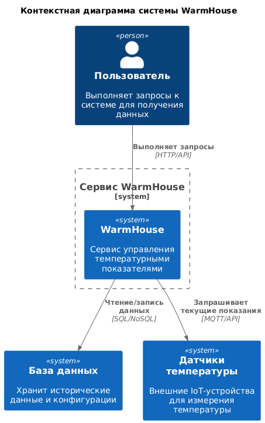
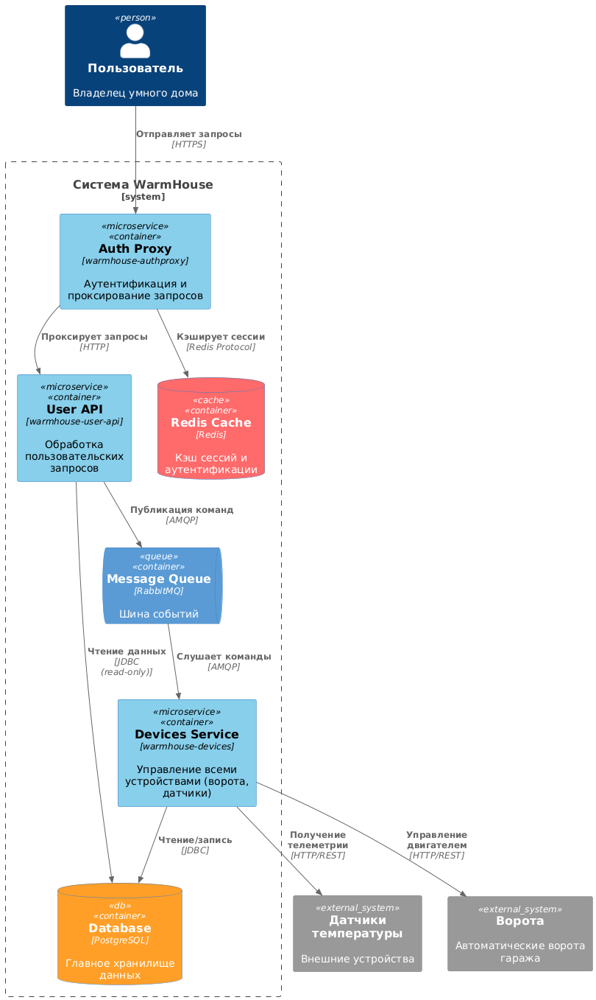
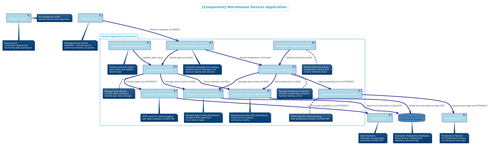
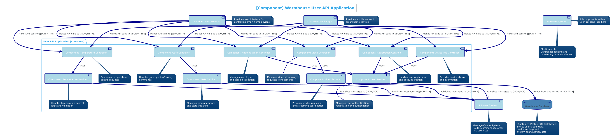
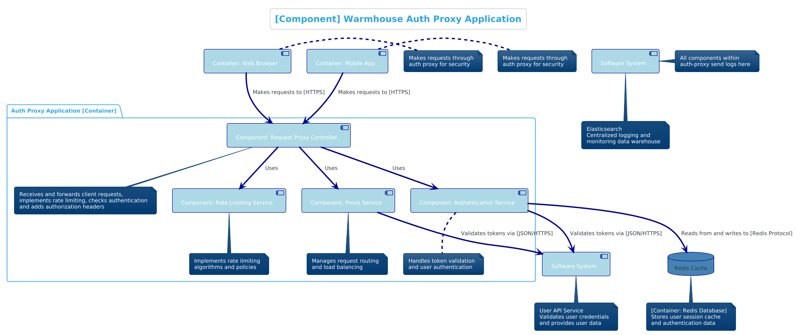
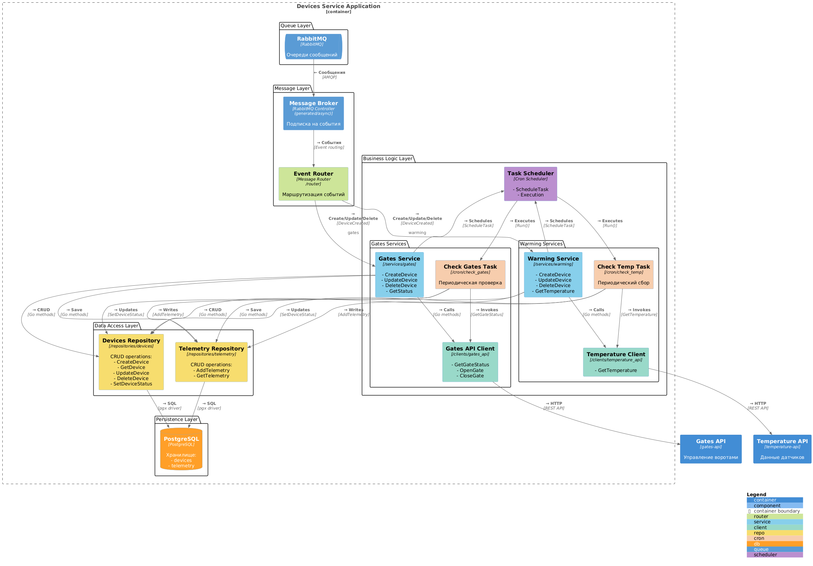
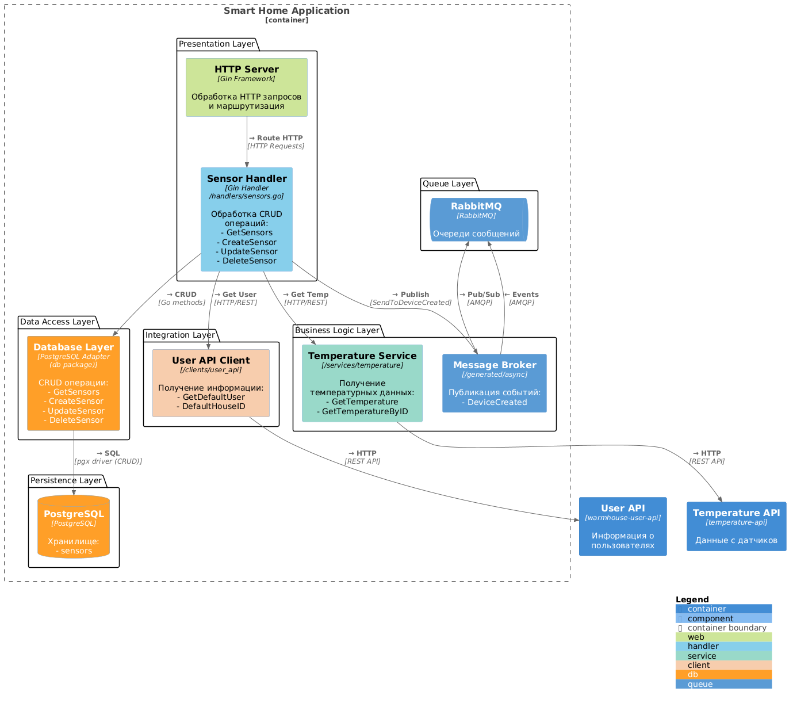
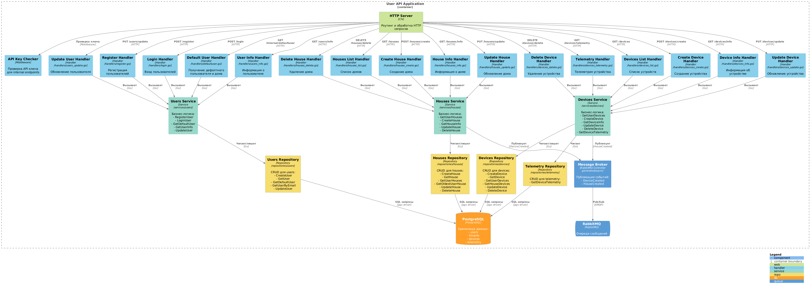
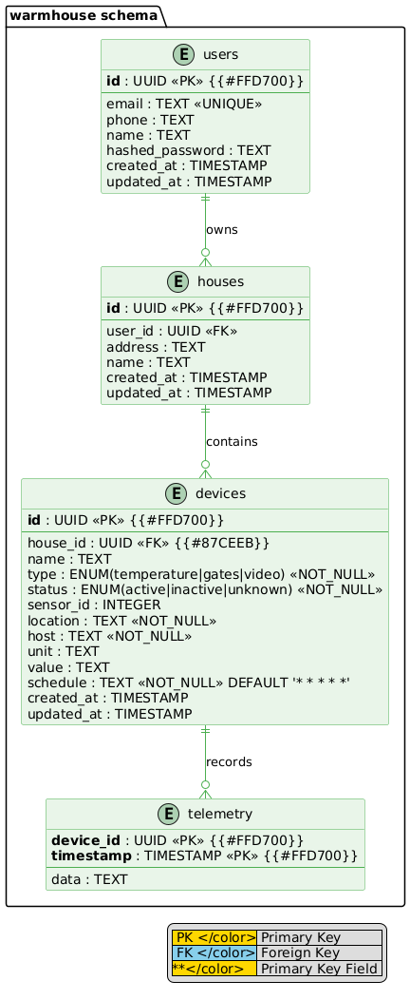

# Project_template

Это шаблон для решения проектной работы. Структура этого файла повторяет структуру заданий. Заполняйте его по мере работы над решением.

# Задание 1. Анализ и планирование

<aside>

Чтобы составить документ с описанием текущей архитектуры приложения, можно часть информации взять из описания компании и условия задания. Это нормально.

</aside

### 1. Описание функциональности монолитного приложения

**Управление отоплением:**

- Пользователи могут создавать сенсоры (одного вида, температурные сенсоры) и производить с ними какие-либо дейстия: удалять, обновлять и так далее. Также есть способ изменить температуру на заданное пользователем значение.
- Система поддерживает разные методы доступа к сенсорам: только чтение (получение информации с сенсора), а также обновление температуры, чтобы управлять отоплением. Также можно удалять старые сенсоры и создавать новые.

**Мониторинг температуры:**

- Пользователи могут мониторить температуру датчиков.
- Система поддерживает получение ранее установленного значения температуры, а также получение текущего значения температуры с датчика.

### 2. Анализ архитектуры монолитного приложения

Перечислите здесь основные особенности текущего приложения: какой язык программирования используется, какая база данных, как организовано взаимодействие между компонентами и так далее.

- Язык программирования: Go.
- База данных: PostgreSQL.
- Взаимодействие с внешними системами: HTTP API.
- Есть несколько компонент: хэндлеры, сервисы, репозитории. Хэндлеры содержат в себе минимальную логику, либо простой запрос в базу (взаимодействие с компонентной репозитория), либо запрос в другую компоненту, сервис температуры. В свою очередь сервис температуры содержит в себе логику получения температуры из внешней системы, взаимодействуя с ней по HTTP.


### 3. Определение доменов и границы контекстов

- Домены:
  - Управление умным домом (устройствами)
  	- Поддомены:
    	- Управление датчиками температуры
			- контекст: просмотр текущей температуры с датчика (по локации или по ID датчика)
			- контекст: проставление нового значения температуры, настройка датчиков
    	- Управление воротами
			- контекст: просмотр состояния ворот
			- контекст: управление воротами
    	- Управление видеокамерами
			- контекст: просмотр видео с камеры
			- контекст: управление видеокамерами
  - Управление пользователями и домами
  	- Поддомены:
    	- Управление авторизацией и аутентификацией
			- контекст: авторизация пользователя
			- контекст: аутентификация пользователя
    	- Управление домами
			- создание дома
			- удаление дома
			- обновление дома
    	- Управление пользователями
			- регистрация пользователя
			- логин пользователя
			- обновление пользователя

### **4. Проблемы монолитного решения**

- Трудно масштабировать.
- Сложно разрабатывать несколькими командами.
- Неудобно релизить
- Любой запрос проксируется в датчик температуры, что не очень хорошо, потому что запрос в датчик может долго отрабатывтаь, и соединение может внезапно прерваться.

Если вы считаете, что текущее решение не вызывает проблем, аргументируйте свою позицию.

### 5. Визуализация контекста системы — диаграмма С4

Добавьте сюда диаграмму контекста в модели C4.



# Задание 2. Проектирование микросервисной архитектуры

В этом задании вам нужно предоставить только диаграммы в модели C4. Мы не просим вас отдельно описывать получившиеся микросервисы и то, как вы определили взаимодействия между компонентами To-Be системы. Если вы правильно подготовите диаграммы C4, они и так это покажут.

**Диаграмма контейнеров (Containers)**



**Диаграмма компонентов (Components)**







**Диаграмма кода (Code)**







# Задание 3. Разработка ER-диаграммы

Добавьте сюда ER-диаграмму. Она должна отражать ключевые сущности системы, их атрибуты и тип связей между ними.



# Задание 4. Создание и документирование API

### 1. Тип API

Укажите, какой тип API вы будете использовать для взаимодействия микросервисов. Объясните своё решение.

Для взаимодействия между пользователем и нашим приложением будет использоваться REST API. Описание в формате OpenAPI будет в файле apps/warmhouse_user_api/api/openapi.yaml. Пользователям удобно пользоваться этим форматом, потому что он простой для восприятия.

Для взаимодействия между микросервисами будет использоваться брокер сообщений RabbitMQ. Описание в формате AsyncAPI будет в файле schemas/asyncapi.yaml. Микросервисы удобно взаимодействовать друг с другом через брокер сообщений, потому что он позволяет нам масштабироваться и обеспечивает независимость микросервисов друг от друга. Также данный подход позволяет быстро отвечать пользователю на его запросы, выполняя всю логику в фоновом режиме.

### 2. Документация API

Здесь приложите ссылки на документацию API для микросервисов, которые вы спроектировали в первой части проектной работы. Для документирования используйте Swagger/OpenAPI или AsyncAPI. Документация для микросервисов будет в файлах apps/warmhouse_user_api/api/openapi.yaml и schemas/asyncapi.yaml.

# Задание 5. Работа с docker и docker-compose

Перейдите в apps.

Там находится приложение-монолит для работы с датчиками температуры. В README.md описано как запустить решение.

Вам нужно:

1) сделать простое приложение temperature-api на любом удобном для вас языке программирования, которое при запросе /temperature?location= будет отдавать рандомное значение температуры.

Locations - название комнаты, sensorId - идентификатор названия комнаты

```
	// If no location is provided, use a default based on sensor ID
	if location == "" {
		switch sensorID {
		case "1":
			location = "Living Room"
		case "2":
			location = "Bedroom"
		case "3":
			location = "Kitchen"
		default:
			location = "Unknown"
		}
	}

	// If no sensor ID is provided, generate one based on location
	if sensorID == "" {
		switch location {
		case "Living Room":
			sensorID = "1"
		case "Bedroom":
			sensorID = "2"
		case "Kitchen":
			sensorID = "3"
		default:
			sensorID = "0"
		}
	}
```

2) Приложение следует упаковать в Docker и добавить в docker-compose. Порт по умолчанию должен быть 8081

3) Кроме того для smart_home приложения требуется база данных - добавьте в docker-compose файл настройки для запуска postgres с указанием скрипта инициализации ./smart_home/init.sql

Для проверки можно использовать Postman коллекцию smarthome-api.postman_collection.json и вызвать:

- Create Sensor
- Get All Sensors

Должно при каждом вызове отображаться разное значение температуры

Ревьюер будет проверять точно так же.


# **Задание 6. Разработка MVP**

Необходимо создать новые микросервисы и обеспечить их интеграции с существующим монолитом для плавного перехода к микросервисной архитектуре. 

### **Что нужно сделать**

1. Создайте новые микросервисы для управления телеметрией и устройствами (с простейшей логикой), которые будут интегрированы с существующим монолитным приложением. Каждый микросервис на своем ООП языке.
2. Обеспечьте взаимодействие между микросервисами и монолитом (при желании с помощью брокера сообщений), чтобы постепенно перенести функциональность из монолита в микросервисы. 

В результате у вас должны быть созданы Dockerfiles и docker-compose для запуска микросервисов. 

### **Результаты**

- Микросервисы:
  - warmhouse_devices - для управления устройствами
  - warmhouse_user_api - для взаимодействия с пользователями и для аутентификации
  - warmhouse_authproxy - для авторизации пользователей
  - smart_home - старый монолит, deprecated

В сервисе warmhouse_devices не реализована логика управление видео, поскольку непонятен протокол взаимодействия с видеокамерами (непонятно, как собирать телеметрию). Полагаю, что это не самая важная часть проекта, поэтому решено было не реализовывать.

Микросервисы взаимодействуют через шину сообщений RabbitMQ.
Также для обратной совместимости с монолитом, в сервисе warmhouse_devices реализована логика управления устройствами через HTTP API.

Для имитации работы ворот был реализован простейшее приложение gates-api, которое отдает состояние ворот и может его менять.

Более детально можно ознакомиться с архитектурой по диаграммам C4.

Запуск системы:
```bash
docker-compose up -d --build
```

Для взаимодействия с датчиками была выбрана pull-модель исходя из заявленного API температурных датчиков.

Плюсы:
	- Простота реализации, от датчиков ничего не требуется кроме одной-двух ручек
	- Нет необходимости в дополнительных библиотеках для работы с датчиками
Минусы:
	- Много "холостых" запросов, которые не дают никакой информации. Например, значение температуры не изменилось
	- Вероятный лаг, так как температура может измениться, а запрос к датчику будет выполняться только через некоторое время.

Возможно было построить решение на основе push-модели, но это потребовало бы дополнительных усилий и дополнительных ресурсов для реализации (нужна была какая-то шина данных между сервером и датчиками). Либо чтобы датчики ходили в ручку сервера.
